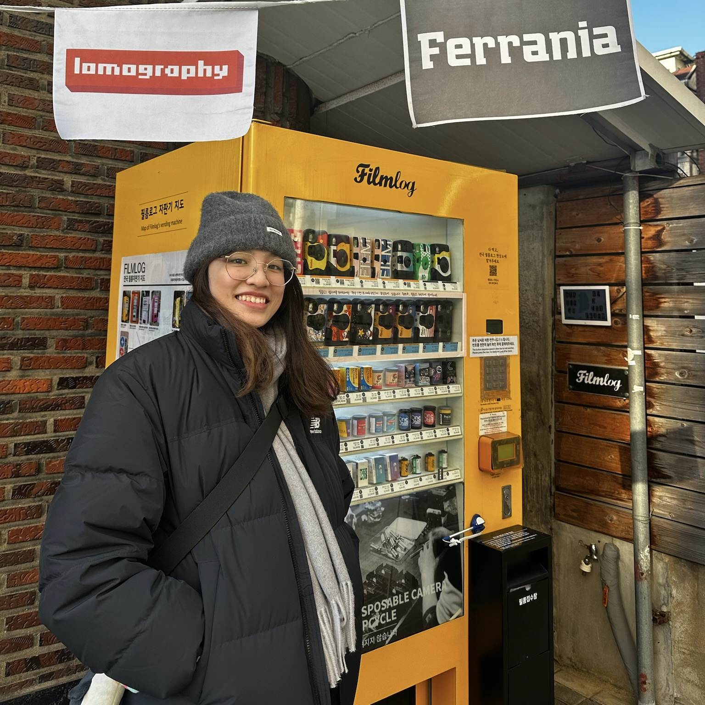

<style type="text/css">
.title {
  display: none;
}
img {
  border-radius: 200px 200px 200px 200px;
}

</style>

<div class="row" style="text-align: center; padding-top: 50px; padding-right: 20px;padding-left: 20px">



```{r, include=FALSE, echo = F}
library(icons)
```

# Chen Liu

`cliu132@ucmerced.edu`

[`r icon_style(academicons("cv"), scale = 2, fill = "#2c3e50")`](pdfs/CV_ChenLiu.pdf)
[`r icon_style(fontawesome("github"), scale = 2, fill = "#2c3e50")`](https://github.com/joyce9936)
</div>

<div class="row" style="text-align: justify; text-justify: inter-word;  padding-top: 2px;padding-right: 20px;padding-left: 20px">


### Academic bio

I earned my Master's degree in the [Cognitive & Information Sciences](https://cogsci.ucmerced.edu) program at UC Merced, where I contributed to research in Dr. Zenaida Aguirre-Muñoz's [Language,Learning, and Teaching Lab](https://www.languagelearningandteachinglab.org/) and Dr. Rachel Ryskin's [Language, Interaction, & Cognition (LInC) lab](https://linclab0.github.io). Currently, I serve as the lab manager in Dr. Zenaida's lab, continuing my collaboration with both professors. My research focuses on bilingual sentence processing, particularly on how second language learners process sentences. 

I completed my undergraduate studies in Special Education (B.Ed.) at National Tsing Hua University. Moreover, I have a keen interest in how technology can facilitate language learning, with a particular focus on reading education.

</div>
